# 🖥️ Computer Shop E-commerce System - Context Diagram

## System Overview
This context diagram shows the external entities and their interactions with the Computer Shop E-commerce Management System.

## Context Diagram (Mermaid)

```mermaid
graph TB
    %% External Entities
    Customer[👤 Customer<br/>Web Browser<br/>Mobile/Desktop]
    Admin[👨‍💼 Admin User<br/>Management Interface<br/>Desktop Browser]
    Staff[👥 Staff Members<br/>Sales & Support<br/>Various Devices]
    
    %% External Services
    Gmail[📧 Gmail SMTP<br/>Email Service<br/>smtp.gmail.com:587]
    AivenDB[(🗄️ Aiven MySQL<br/>Database Server<br/>mysql-5a32e04-...d.aivencloud.com:23044)]
    RailwayStatic[☁️ Railway Static<br/>File Storage<br/>static.railway.app]
    BakongKHQR[💳 Bakong KHQR<br/>Payment System<br/>QR Code Generation]
    
    %% Core System
    ComputerShop[🖥️ Computer Shop<br/>E-commerce System<br/>Flask Application<br/>Railway Platform]
    
    %% System Components (Internal)
    WebApp[🌐 Web Application<br/>Flask 2.3 + Gunicorn<br/>Python 3.9+]
    Database[(📊 MySQL Database<br/>User Data, Products<br/>Orders, Reports)]
    FileStorage[📁 File Storage<br/>Product Images<br/>Payment Screenshots]
    EmailService[📬 Email Service<br/>OTP Delivery<br/>Notifications]
    PaymentSystem[💳 Payment System<br/>QR Code Generation<br/>Payment Verification]
    
    %% External Entity Interactions
    Customer -->|Browse Products<br/>Add to Cart<br/>Place Orders<br/>Upload Payments| ComputerShop
    Admin -->|Manage Inventory<br/>Process Orders<br/>Generate Reports<br/>User Management| ComputerShop
    Staff -->|Handle Orders<br/>Customer Support<br/>Inventory Updates| ComputerShop
    
    %% External Service Interactions
    ComputerShop -->|Send OTP<br/>Order Confirmations<br/>Password Reset| Gmail
    ComputerShop -->|Store Data<br/>Retrieve Information<br/>Transaction Records| AivenDB
    ComputerShop -->|Store Images<br/>Serve Static Files<br/>File Management| RailwayStatic
    ComputerShop -->|Generate QR Codes<br/>Process Payments<br/>Payment Verification| BakongKHQR
    
    %% Internal System Flow
    ComputerShop --> WebApp
    WebApp --> Database
    WebApp --> FileStorage
    WebApp --> EmailService
    WebApp --> PaymentSystem
    
    %% Database Connection
    Database -.->|External Connection| AivenDB
    FileStorage -.->|CDN Storage| RailwayStatic
    EmailService -.->|SMTP Connection| Gmail
    PaymentSystem -.->|API Integration| BakongKHQR
    
    %% Styling
    classDef externalEntity fill:#e1f5fe,stroke:#01579b,stroke-width:2px
    classDef externalService fill:#f3e5f5,stroke:#4a148c,stroke-width:2px
    classDef coreSystem fill:#e8f5e8,stroke:#1b5e20,stroke-width:3px
    classDef internalComponent fill:#fff3e0,stroke:#e65100,stroke-width:2px
    
    class Customer,Admin,Staff externalEntity
    class Gmail,AivenDB,RailwayStatic,BakongKHQR externalService
    class ComputerShop coreSystem
    class WebApp,Database,FileStorage,EmailService,PaymentSystem internalComponent
```

## Key External Entities

### 1. **Customer** 👤
- **Role**: End users browsing and purchasing products
- **Interactions**:
  - Browse product catalog
  - Add/remove items from cart
  - Place orders and checkout
  - Upload payment screenshots
  - Manage account and orders
  - Receive OTP and notifications

### 2. **Admin User** 👨‍💼
- **Role**: System administrators managing the entire platform
- **Interactions**:
  - Manage product inventory
  - Process and track orders
  - Generate sales reports
  - Manage user accounts and roles
  - Configure system settings
  - Monitor system performance

### 3. **Staff Members** 👥
- **Role**: Sales and support staff assisting customers
- **Interactions**:
  - Handle customer inquiries
  - Process walk-in sales
  - Update inventory levels
  - Manage customer orders
  - Provide customer support

## External Services

### 1. **Gmail SMTP** 📧
- **Purpose**: Email delivery service
- **Interactions**:
  - Send OTP verification codes
  - Deliver order confirmations
  - Send password reset emails
  - System notifications

### 2. **Aiven MySQL Database** 🗄️
- **Purpose**: Primary data storage
- **Interactions**:
  - Store user accounts and profiles
  - Manage product catalog
  - Record orders and transactions
  - Generate reports and analytics

### 3. **Railway Static Storage** ☁️
- **Purpose**: File and asset storage
- **Interactions**:
  - Store product images
  - Host payment screenshots
  - Serve static assets (CSS, JS)
  - CDN delivery for performance

### 4. **Bakong KHQR Payment System** 💳
- **Purpose**: Payment processing
- **Interactions**:
  - Generate QR codes for payments
  - Process payment verification
  - Handle payment transactions
  - Support Cambodian payment methods

## System Architecture

### **Core System Components**:

1. **Web Application** 🌐
   - Flask 2.3 framework
   - Gunicorn WSGI server
   - Python 3.9+ runtime
   - Hosted on Railway platform

2. **Database Layer** 📊
   - MySQL 8.0 database
   - External connection to Aiven
   - Data persistence and retrieval
   - Transaction management

3. **File Storage** 📁
   - Static file management
   - Image processing and optimization
   - CDN-backed delivery
   - Upload handling

4. **Email Service** 📬
   - SMTP integration
   - Automated email delivery
   - Template-based messaging
   - OTP and notification system

5. **Payment System** 💳
   - QR code generation
   - Payment verification
   - Bakong KHQR integration
   - Transaction processing

## Data Flow

### **Customer Journey**:
1. Customer accesses the web application
2. Browses products and adds items to cart
3. Proceeds to checkout
4. Receives QR code for payment
5. Uploads payment screenshot
6. Receives order confirmation via email

### **Admin Operations**:
1. Admin logs into management interface
2. Manages inventory and products
3. Processes customer orders
4. Generates reports and analytics
5. Monitors system performance

### **Staff Activities**:
1. Staff assists customers
2. Updates inventory as needed
3. Handles order processing
4. Provides customer support
5. Manages daily operations

## Security & Compliance

- **HTTPS Enforcement**: All communications encrypted
- **Authentication**: Multi-factor authentication with OTP
- **Data Protection**: Secure password storage and encryption
- **Payment Security**: PCI DSS compliant payment processing
- **Session Management**: Secure session handling

## Performance & Scalability

- **Response Time**: < 2 seconds page load
- **Concurrent Users**: 100+ (scalable to 1000+)
- **Database**: Optimized queries and indexing
- **CDN**: Global content delivery
- **Auto-scaling**: Railway platform capabilities

---

**Document Version**: 1.0  
**Created**: December 2024  
**System**: Computer Shop E-commerce Management System
