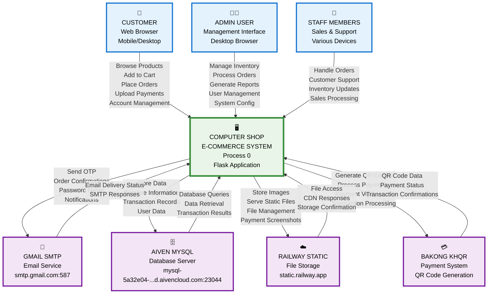

# 🖥️ Computer Shop E-commerce System - Level 0 Context Diagram

## Visual Context Diagram (Level 0 DFD)



## ASCII-Style Context Diagram

```
┌─────────────────────────────────────────────────────────────────┐
│                    EXTERNAL ENTITIES                           │
│  ┌─────────────┐  ┌─────────────┐  ┌─────────────┐             │
│  │  CUSTOMER   │  │ ADMIN USER  │  │   STAFF     │             │
│  │Web Browser  │  │Management   │  │Sales &      │             │
│  │Mobile/Desktop│  │Interface    │  │Support      │             │
│  └─────────────┘  └─────────────┘  └─────────────┘             │
└─────────────────────┬───────────────────────────────────────────┘
                      │
┌─────────────────────▼───────────────────────────────────────────┐
│              COMPUTER SHOP E-COMMERCE SYSTEM                   │
│                    (Process 0)                                 │
│              Flask Application - Railway Platform              │
└─────────────────────┬───────────────────────────────────────────┘
                      │
┌─────────────────────▼───────────────────────────────────────────┐
│                  EXTERNAL SYSTEMS                              │
│  ┌─────────────┐  ┌─────────────┐  ┌─────────────┐  ┌─────────┐ │
│  │GMAIL SMTP   │  │AIVEN MYSQL  │  │RAILWAY STATIC│  │BAKONG   │ │
│  │Email Service│  │Database     │  │File Storage │  │KHQR     │ │
│  │smtp.gmail   │  │mysql-5a32e04│  │static.railway│  │Payment  │ │
│  │.com:587     │  │...d.aiven   │  │.app         │  │System   │ │
│  └─────────────┘  └─────────────┘  └─────────────┘  └─────────┘ │
└─────────────────────────────────────────────────────────────────┘
```

## Data Flow Summary

### **Input Flows (Into System):**
- **Customer** → Browse Products, Add to Cart, Place Orders, Upload Payments
- **Admin** → Manage Inventory, Process Orders, Generate Reports, User Management
- **Staff** → Handle Orders, Customer Support, Inventory Updates, Sales Processing

### **Output Flows (From System):**
- **Gmail** → Send OTP, Order Confirmations, Password Reset, Notifications
- **AivenDB** → Store Data, Retrieve Information, Transaction Records, User Data
- **RailwayStatic** → Store Images, Serve Static Files, File Management
- **BakongKHQR** → Generate QR Codes, Process Payments, Payment Verification

### **Response Flows (Back to System):**
- **Gmail** → Email Delivery Status, SMTP Responses
- **AivenDB** → Database Queries, Data Retrieval, Transaction Results
- **RailwayStatic** → File Access, CDN Responses, Storage Confirmation
- **BakongKHQR** → QR Code Data, Payment Status, Transaction Confirmations

---

**Document Version**: 1.0  
**Created**: December 2024  
**System**: Computer Shop E-commerce Management System

